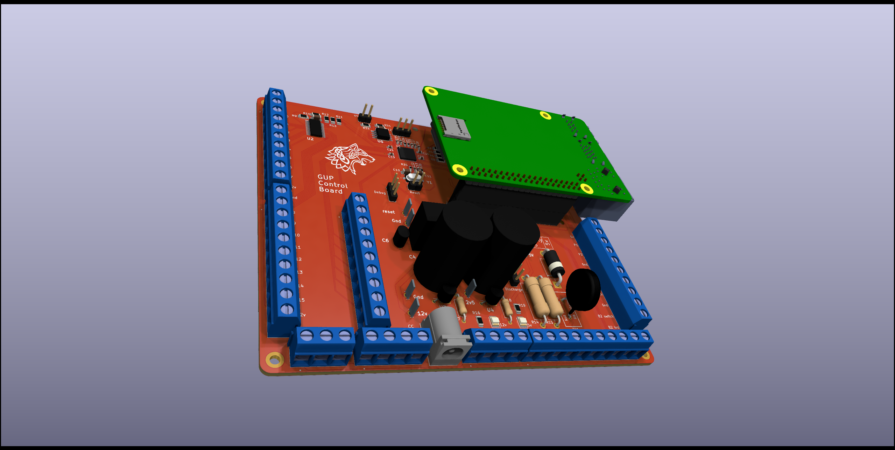
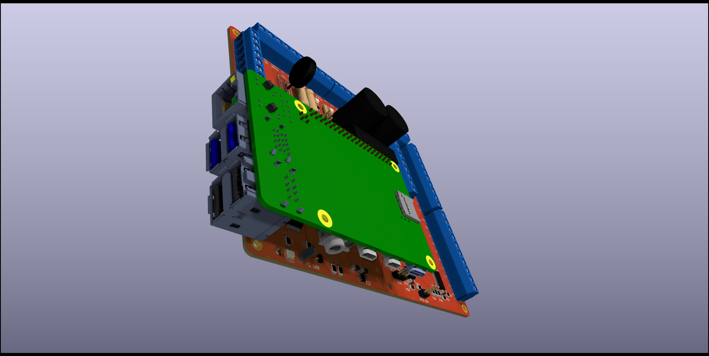
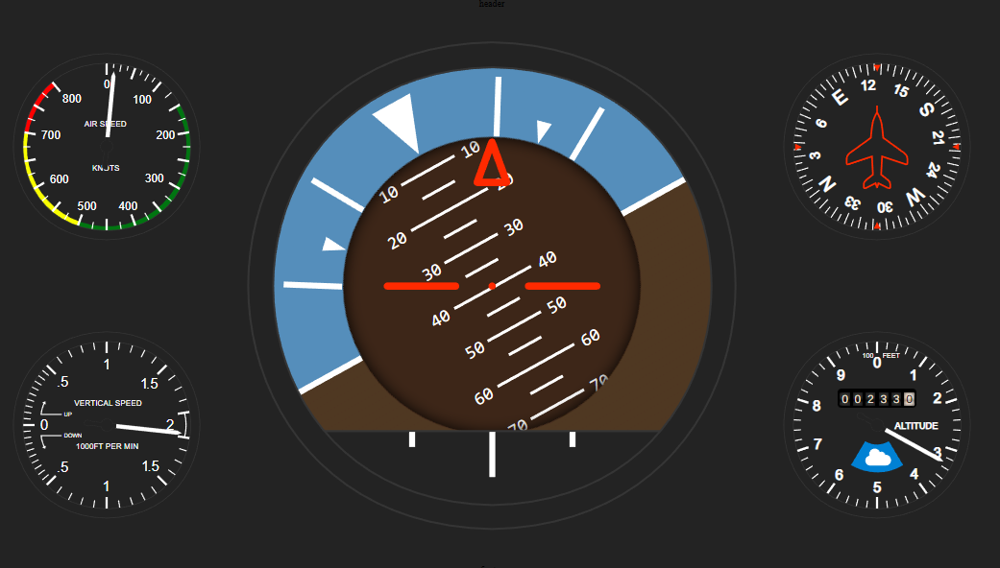

# KidsControlPanel
Octonaut's inspired vehicle control panel with flight yoke and standard instruments

Javascript application runs instrument cluster on Raspberry Pi displaying on a (800x400) lcd panel

Custom RP2040 based hardware runs the remaining panel functions

RP2040 board appears as a HID joystick and uses a VL6180X ranging sensor to measure pitch, and an AS5600 magnetic Rotation Sensor to measure roll.

